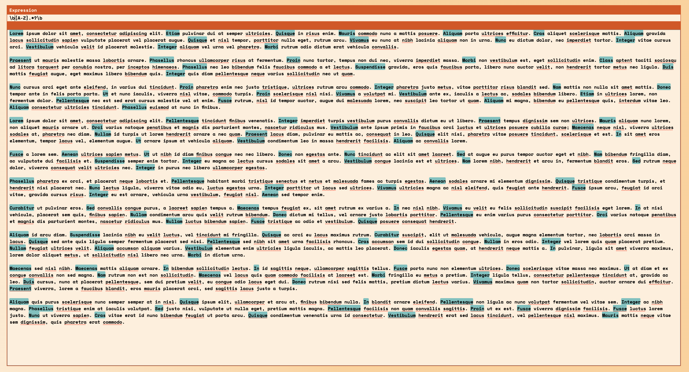

# Regex Helper

## What?
A simple tool that highlights your regular expression matches.

## Why?
A lot of online tools store your data; making them unusable with sensitive data.
This tool does the most basic version of helping you validate your regex. It's
frontend all the way down!

Also, the whole implementation is a single svelte component so if you don't trust me,
spend 10 minutes skimming through the source and deploying it yourself.

## How?

```sh
# For dev server.
$ npm i && npm run dev

# For prod.
$ npm i && npm run build
```

## Where?

This is hosted at [aravindvasu.dev/regex_helper](https://aravindvasu.dev/regex_helper/).

## May I?

Sure, send in a pull-request or file an issue.